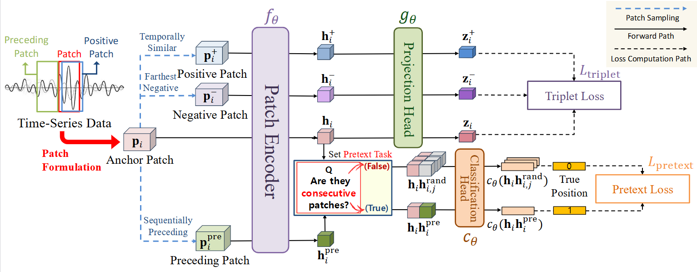
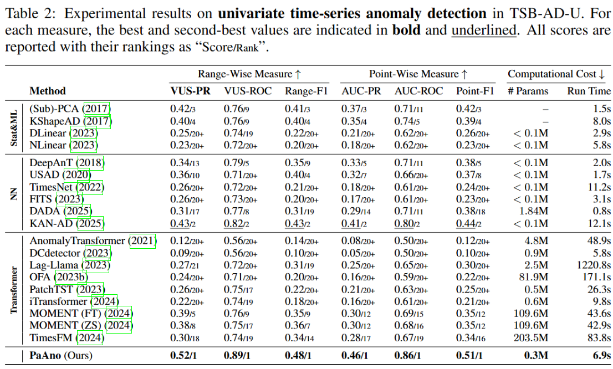
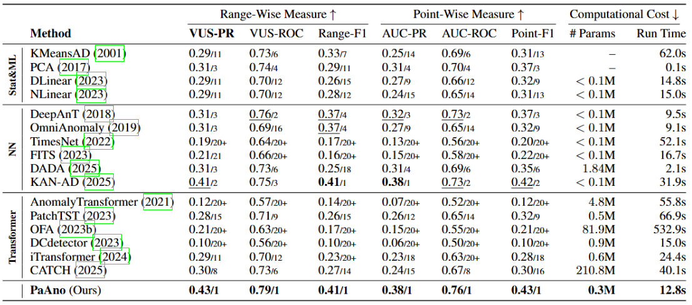
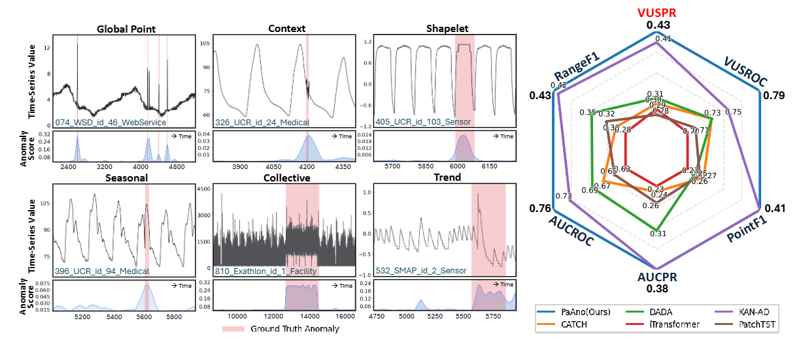

<div align="center">
<h1>
<strong>[ICLR 2026] PaAno</strong>: <strong>Pa</strong>tch-based Representation Learning for Time-Series <strong>Ano</strong>maly Detection
</h1>
</div>

<div align="center">
<a href="https://arxiv.org/pdf/2410.12261">
  
</a>
<a href="https://www.python.org/">
  
</a>
<a href="https://pytorch.org/">
  
</a>
</div>


This repository is the official Pytorch implementation code of our <strong>"PaAno : Patch-based Representation Learning for Time-Series Anomaly Detection - Jinju Park, Seokho Kang".</strong> PaAno is a simple yet effective representation-based method for fast and efficient time-series anomaly detection. Our paper is available here: [[Paper Link]](https://arxiv.org/abs/2602.01359)


🎉 [2026.1] PaAno has been accepted in ICLR 2026!


## Abstract 

Although recent studies on time-series anomaly detection have increasingly adopted ever-larger neural network architectures such as transformers and foundation models, they incur high computational costs and memory usage, making them impractical for real-time and resource-constrained scenarios. Moreover, they often fail to demonstrate significant performance gains over simpler methods under rigorous evaluation protocols. In this study, we propose Patch-based representation learning for time-series Anomaly detection (PaAno), a lightweight yet effective method for fast and efficient time-series anomaly detection. PaAno extracts short temporal patches from time-series training data and uses a 1D convolutional neural network to embed each patch into a vector representation. The model is trained using a combination of triplet loss and pretext loss to ensure the embeddings capture informative temporal patterns from input patches. During inference, the anomaly score at each time step is computed by comparing the embeddings of its surrounding patches to those of normal patches extracted from the training time-series. Evaluated on the TSB-AD benchmark, PaAno achieved state-of-the-art performance, significantly outperforming existing methods, including those based on heavy architectures, on both univariate and multivariate time-series anomaly detection across various range-wise and point-wise performance measures.

<div align="center">



</div>

## Installation

Clone the repository and set up the environment as follows:

```bash
# Make conda environment
conda create -n PaAno python=3.11 -y
conda activate PaAno

# Install dependencies
pip install -r requirements.txt
```

---

## Demo Usage

We provide a shell script for convenient execution. Once dependencies are installed, simply run:

```bash
# Univariate time-series anomaly detection
bash script/run_uni.sh
```
or 

```bash
# Multivariate time-series anomaly detection
bash script/run_mul.sh
```

This will launch PaAno with the default configuration. Sample data from the TSB-AD benchmark are included in the data/ directory for quick and easy start.

---

## Dataset

Please download data from https://github.com/thedatumorg/TSB-AD and move to data/.

---


## Project Structure
```
PaAno/
├── affiliation/                 
│   ├── __init__.py
│   ├── affiliation_zone.py
│   ├── integral_interval.py
│   ├── single_ground_truth_event.py
│   ├── generics.py
│   └── metrics.py
│
├── assets/   # for README.md                  
│   ├── mul_results.png
│   ├── qualitative_results.png
│   └── train.png 
│   └── uni_results.png
│
├── data/                       
│   ├── TSB-AD-M/               
│   └── TSB-AD-U/                
│
├── script/                     
│   ├── run_mul.sh               
│   └── run_uni.sh               
│
├── utils/                       
│   ├── __init__.py
│   ├── basic_metrics.py         
│   ├── data_preprocess.py       
│   ├── evaluation.py            
│   ├── metrics.py               
│   └── utils.py                 
│
├── main.py                      
├── model.py                     
├── train.py                    
├── README.md
└── requirements.txt

```

## Results

**PaAno consistently outperforms 39 baseline methods** on the TSB-AD benchmark for **univariate time-series anomaly detection**.

<div align="center">



</div>


**PaAno also robustly outperforms 31 baseline methods** on the TSB-AD benchmark for **multivariate time-series anomaly detection**.


<div align="center">
  


</div>


Furthermore, PaAno is shown to be effective in capturing various types of anomalies and yields stable performance across all six evaluation metrics compared with the five strong recent methods.




</div>


---

## Acknowledgement

We sincerely appreciate the following GitHub repositories for their valuable contributions:

https://github.com/TheDatumOrg/TSB-AD

https://github.com/thuml/Time-Series-Library

https://github.com/decisionintelligence/CATCH

---


## Citation

If you think our repo is useful, please cite our paper: 


---


